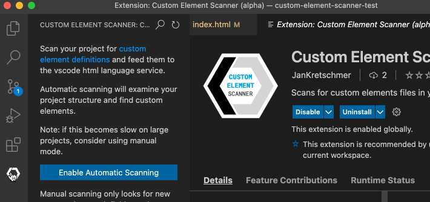
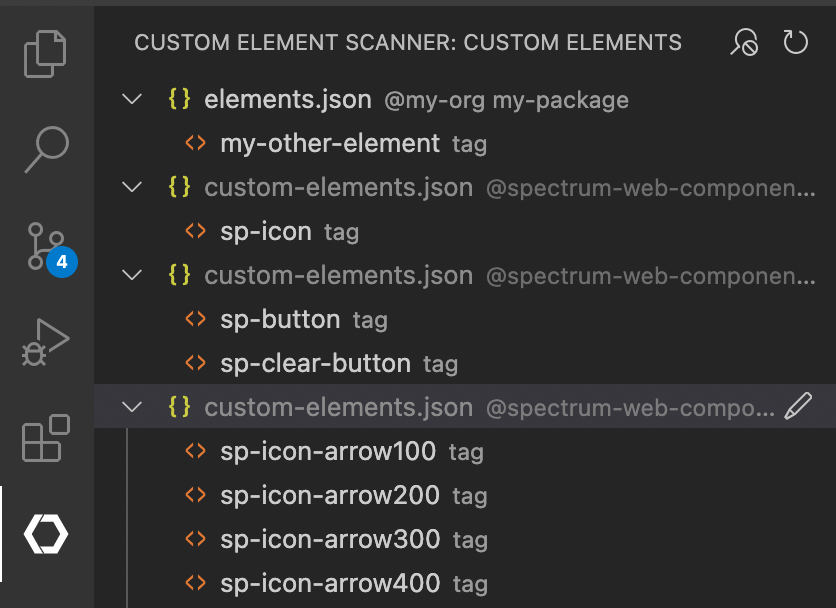

# VSCode Custom Data Scanner

Discovers custom element definitions in your workspace and makes them available to the html-language-service of vscode.

Looks for `customElements` field in all package.json files it discovers,
but can also be configured to also look for `costum-elements.json` files directly.

Supports the following formats:

- [vscode-custom-data](https://github.com/microsoft/vscode-custom-data/tree/main/samples/webcomponents)
- [custom-elements.json](https://github.com/webcomponents/custom-elements-manifest) (is auto-converted to vscode format)

Adds a Custom Elements View Containers to VSCode that gives an overview of which definitions have been discovered

